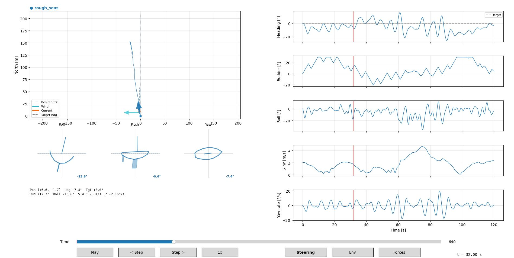

# sailsim — Sailing Yacht Autopilot Simulator

Note: This project is in early development. The core physics engine and viewer are functional, but the autopilot and scenario library are still being built out.
Contributions and feedback are welcome!

A physics-based simulation framework for developing and testing sailing yacht autopilots. It models the coupled dynamics of wind, waves, current, and vessel response so that autopilot controllers can be evaluated under realistic conditions — without going on the water.



## Purpose

Autopilot tuning on a real sailboat is slow, weather-dependent, and hard to reproduce. This simulator provides a deterministic, repeatable environment where you can:

- **Compare controller tunings** side-by-side under identical conditions
- **Run regression tests** — scenarios with quality gates catch regressions automatically
- **Explore edge cases** — heavy gusts, beam seas, tacking/gybing — that are dangerous or rare in practice
- **Visualize everything** — an interactive playback viewer shows heading, forces, roll, wind, and more

## What is Simulated

### Vessel Dynamics

The core physics engine solves the rigid-body equations of motion in the body-fixed frame. Two fidelity levels are available:

| Mode | Degrees of Freedom | States | Use Case |
|------|-------------------|--------|----------|
| **3-DOF** | Surge, Sway, Yaw (x, y, psi) | Position + heading in the horizontal plane | Fast iteration, controller tuning |
| **6-DOF** | + Heave, Roll, Pitch (z, phi, theta) | Full spatial motion including heel and trim | Realistic dynamics, wave response |

Both modes use Fossen's marine vessel convention with added-mass, linear damping, and quadratic damping terms.

### Force Models

| Component | What it Computes |
|-----------|-----------------|
| **Sail aerodynamics** | Lift/drag from apparent wind via flat-plate CL/CD model, applied at the sail's centre of effort |
| **Rudder hydrodynamics** | Lift/drag on the rudder blade from local flow, including boat speed and yaw rate contributions |
| **Keel hydrodynamics** | Lateral resistance from the keel, modelled with the same lift/drag approach as the rudder |
| **Wave forces** | 1st-order wave excitation from a spectral sea state (JONSWAP or Pierson-Moskowitz), resolved per frequency component |
| **Hydrostatics** (6-DOF) | Restoring forces in heave, roll, and pitch following Fossen's g(eta) formulation |

### Environment

- **Wind**: constant, gust (Ornstein-Uhlenbeck process), or shifting (linear / sinusoidal direction changes)
- **Waves**: spectral model with configurable Hs, Tp, direction, and random seed
- **Current**: none, constant, or tidal (sinusoidal speed variation)

### Autopilot

The autopilot is pluggable — any implementation that satisfies the `AutopilotProtocol` (a `compute()` + `set_target_heading()` interface) can be used. Four implementations are included:

- **Nomoto** (`type = "nomoto"`) — model-based heading controller that derives gains from the yacht's hydrodynamic coefficients using pole placement (natural frequency omega_n and damping ratio zeta). Includes rudder rate limiting and optional automatic sail trim based on apparent wind angle.
- **SignalK** (`type = "signalk"`) — adapter stub for the original [SignalK](https://signalk.org/) reference server. Currently out of scope: the reference server is a data hub without a built-in autopilot, so there is no autopilot provider to test against. signalk-rs and pypilot both include their own autopilot and can be tested end-to-end directly.
- **signalk-rs** (`type = "signalk_rs"`) — adapter for [signalk-rs](https://github.com/herostrat/signalk-rs), a Rust-based SignalK server with a built-in PID autopilot (gain scheduling, anti-windup, heel compensation, gust response). Sensors via NMEA-0183 TCP, rudder readback via HTTP, control via V2 Autopilot API. *Note: Docker image not yet available.*
- **pypilot** (`type = "pypilot"`) — adapter for the open-source [pypilot](https://pypilot.org/) autopilot. Communicates via NMEA-0183 (sensors) and JSON-TCP (control/servo). Runs in Docker for testing.

### Navigation

- **Heading hold** — maintain a fixed compass heading
- **Scheduled maneuvers** — heading changes at specific times to simulate tacking and gybing sequences
- **Waypoint following** — line-of-sight guidance steers the boat through an ordered list of waypoints, advancing to the next when within a configurable tolerance radius

## Installation

Requires Python 3.12+.

```bash
git clone <repo-url>
cd sailsim
pip install -e ".[dev]"
```

## Usage

Every simulation combines three independent inputs:

| Input | Flag | Default | What it defines |
|-------|------|---------|-----------------|
| **Scenario** | `--scenario` | `calm_heading_hold` | Environment, timing, maneuvers, quality gates |
| **Yacht** | `--yacht` | `default` | Hull shape, mass, rig, appendages |
| **Autopilot** | `--autopilot` | `heading_hold` | Controller type and tuning |

### Run a scenario

```bash
sailsim --scenario calm_heading_hold --yacht default --autopilot heading_hold
```

This runs the simulation, evaluates quality gates, and prints a pass/fail summary. Exit code 0 means all gates passed. All three flags accept either a profile name (resolved from `configs/<type>/<name>.toml`) or a full TOML path. Since `default` and `heading_hold` are the defaults, this is equivalent to just `sailsim --scenario calm_heading_hold`.

### Mix and match

Yacht and autopilot are always separate from the scenario, so you can freely combine them:

```bash
# J24 hull with aggressive tack tuning
sailsim --scenario tack_port_to_starboard --yacht j24 --autopilot tack

# Same scenario, different boat
sailsim --scenario tack_port_to_starboard --yacht swan45 --autopilot tack

# Custom autopilot from a TOML file
sailsim --scenario calm_heading_hold --autopilot /path/to/my_gains.toml
```

### Use an external autopilot

Both signalk-rs and pypilot include their own autopilot and can be tested end-to-end. The original SignalK reference server is a data hub without a built-in autopilot, so it is currently out of scope.

```bash
# signalk-rs (Docker image not yet available)
sailsim --scenario calm_heading_hold --autopilot signalk_rs

# pypilot (requires Docker)
sailsim --scenario pypilot_heading_hold --autopilot pypilot
```

### Run and view interactively

```bash
sailsim --scenario rough_seas --view
```

Opens the playback viewer after the simulation completes. Use the timeline slider to scrub through the recording.

### Save and compare recordings

```bash
# Save two runs with different tunings
sailsim --scenario compare_conservative --save-json /tmp/conservative.json
sailsim --scenario compare_aggressive --save-json /tmp/aggressive.json

# Compare side-by-side in the viewer
sailsim --view /tmp/conservative.json /tmp/aggressive.json
```

### Run a waypoint route

```bash
sailsim --scenario waypoint_triangle --autopilot tack --save-json /tmp/triangle.json --view
```

Waypoints are defined in the scenario TOML:

```toml
[[route.waypoints]]
x = 100.0    # North [m]
y = 0.0      # East [m]
tolerance = 15.0  # reached when within 15 m

[[route.waypoints]]
x = 100.0
y = 100.0
tolerance = 15.0
```

### Stability analysis

A dedicated analysis tool computes classical control-theory stability metrics for any autopilot. It works in two modes — model-based (analytical) and data-driven (empirical). See [docs/stability_analysis.md](docs/stability_analysis.md) for the full theory.

```bash
# Analytical: Bode, Nyquist, pole-zero at a single speed
python scripts/analyze_autopilot.py analytical --yacht default --speed 3.0

# Analytical: stability margins across a speed range
python scripts/analyze_autopilot.py analytical --yacht default --sweep

# Empirical: analyse a recorded simulation
python scripts/analyze_autopilot.py empirical recording.json

# Full: run simulation + both analyses
python scripts/analyze_autopilot.py full --scenario calm_heading_hold
```

### Export telemetry to CSV

```bash
sailsim --scenario calm_heading_hold --output telemetry.csv
```

### CLI reference

| Flag | Description |
|------|-------------|
| `--scenario NAME\|PATH` | Scenario profile name or TOML path (default: `calm_heading_hold`) |
| `--yacht NAME\|PATH` | Yacht profile name or TOML path (default: `default`) |
| `--autopilot NAME\|PATH` | Autopilot profile name or TOML path (default: `heading_hold`) |
| `--view [JSON...]` | Launch viewer. No args: run + view. With args: load and compare JSON files |
| `--save-json PATH` | Save recording as JSON |
| `--output PATH` | Export telemetry to CSV |
| `--quiet` | Suppress progress output |
| `--json PATH` | Alias for `--save-json` |

### Shell completion

Tab completion for flags, scenario paths, and profile names is available for Bash and Zsh.

**Bash** — add to `~/.bashrc`:

```bash
source /path/to/sailing_autopilot_simultator/completions/sailsim.bash
```

**Zsh** — add to `~/.zshrc` (before `compinit`):

```zsh
source /path/to/sailing_autopilot_simultator/completions/sailsim.zsh
```

Or copy `completions/sailsim.zsh` to a directory in your `$fpath` as `_sailsim`.

Completion works for:
- `--scenario` — profile names from `configs/scenarios/` + TOML file paths
- `--yacht` — profile names from `configs/yachts/` + TOML file paths
- `--autopilot` — profile names from `configs/autopilots/` + TOML file paths
- `--view` — JSON files
- `--output` / `--save-json` — file paths

## Viewer

The interactive playback viewer has three pages, switchable via buttons or keyboard (`1` / `2` / `3`):

**Steering** — Heading (with target), rudder angle, roll, speed through water, yaw rate.

**Environment** — True wind speed and direction, wave elevation, speed over ground, sail trim.

**Forces** — Per-component force breakdown (sail, rudder, keel, waves) for surge, sway, and yaw moment, plus pitch.

The left column shows the vessel trajectory with a desired track line (dotted), waypoint markers and tolerance circles (when applicable), attitude indicators (yacht cross-section views for roll, pitch, and yaw), and a numeric readout at the cursor position. Multiple recordings overlay with distinct colours for comparison.

## Configuration

The configuration system is composable: scenario, yacht, and autopilot are always separate inputs.

### Scenarios

Scenarios define *what happens* — environment, timing, initial conditions, maneuvers, and quality gates. They do **not** contain yacht or autopilot parameters.

```toml
name = "calm_heading_hold"
duration_s = 120.0
dt = 0.05
target_heading = 0.0

[wind]
speed = 5.0
direction = 1.047

[initial_state]
psi = 0.1
u = 2.0

[quality_gates]
max_heading_deviation_deg = 10.0
max_settling_time_s = 30.0
```

Scenario files live in `configs/scenarios/`.

| Scenario | Description |
|----------|-------------|
| `calm_heading_hold.toml` | Light wind, basic heading hold |
| `moderate_beam_reach.toml` | Moderate beam reach |
| `rough_seas.toml` | Gusts, waves (Hs=1.0m), and current |
| `tack_port_to_starboard.toml` | Tacking maneuver with scheduled heading change |
| `gybe_starboard_to_port.toml` | Gybing maneuver |
| `compare_conservative.toml` | Gusty close reach for tuning comparison |
| `compare_aggressive.toml` | Same conditions, different quality gates |
| `waypoint_triangle.toml` | 3 waypoints forming a triangle |
| `pypilot_heading_hold.toml` | 60s pypilot benchmark (Docker, real-time paced) |
| `signalk_rs_heading_hold.toml` | 60s signalk-rs benchmark (Docker, real-time paced) |

### Yacht profiles

Yacht parameter files live in `configs/yachts/`. Each defines hull mass, rig dimensions, appendages, and hydrodynamic coefficients.

Available hulls: `default`, `j24`, `swan45`, `dehler34`, `hr62`, `imoca60`, `mini650`.

### Autopilot profiles

Autopilot configurations live in `configs/autopilots/`:

| Profile | Type | Description |
|---------|------|-------------|
| `heading_hold` | Nomoto | Moderate gains (omega_n=0.5, zeta=0.8) for steady-state course keeping |
| `tack` | Nomoto | Responsive gains (omega_n=0.6, zeta=0.7) with fast rudder for tacking |
| `gybe` | Nomoto | Moderate gains (omega_n=0.5, zeta=0.7) with fast rudder for gybing |
| `signalk` | SignalK | Stub for original SignalK reference server (out of scope — no built-in autopilot) |
| `signalk_rs` | signalk-rs | External autopilot via signalk-rs — Rust-based SignalK with PID (Docker image not yet available) |
| `pypilot` | pypilot | External autopilot via pypilot (Docker) |

### Quality gates

Each scenario defines pass/fail thresholds:

- **Max heading deviation** — largest instantaneous error from target
- **Max settling time** — time until heading stays within tolerance
- **Max mean heading error** — average absolute error over the run
- **Max rudder rate** — limits actuator speed to prevent unrealistic control

## Project Structure

```
src/sailsim/
  analysis/        Stability analysis (linear TFs, empirical spectral, plots, reports)
  autopilot/       Autopilot protocol, Nomoto controller, SignalK/pypilot adapters, factory
  core/            Config loading, simulation runner, data types
  environment/     Wind, wave, and current models
  physics/         Aerodynamics, hydrodynamics, hydrostatics, wave forces, integration
  recording/       Time-series recorder, JSON/CSV export, quality gate analysis
  sensors/         Sensor data extraction from vessel state
  vessel/          3-DOF and 6-DOF yacht models
  viewer/          Interactive matplotlib playback viewer
  cli.py           Command-line interface

scripts/
  analyze_autopilot.py   Stability analysis CLI (analytical / empirical / full)
  stability_check.py     Quick divergence check across yacht profiles
  estimate_yacht_coefficients.py   Coefficient estimation from hull dimensions

completions/       Bash and Zsh tab completion scripts

configs/
  autopilots/      Autopilot profile TOMLs (Nomoto tunings, SignalK, pypilot)
  scenarios/       TOML scenario definitions (environment, timing, maneuvers)
  yachts/          Yacht parameter files (hull, rig, appendages)

docs/
  stability_analysis.md     Control-theoretic stability analysis guide
  yacht_coefficient_estimation.md   Hull-to-parameter derivation

tests/
  unit/            Unit tests for individual modules
  integration/     Physics validation and recording tests
  scenarios/       End-to-end scenario tests with quality gates
```

## License

MIT
